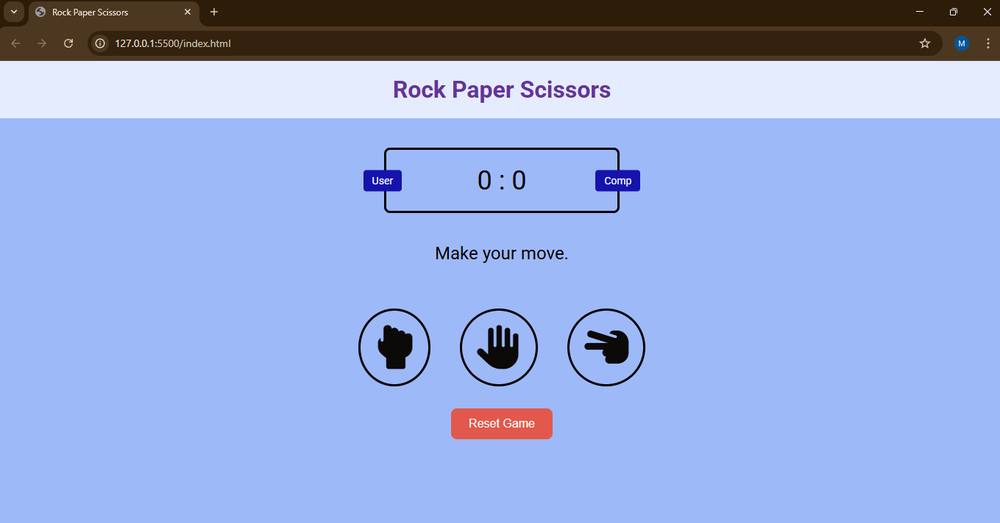

# ✊✋✌️ Rock Paper Scissors Game

A simple and responsive Rock-Paper-Scissors game built using **HTML**, **CSS**, and **JavaScript**.  
Play against the computer and track your score — now with a **Reset** button and **mobile responsiveness**!

---

## 🔗 Live Demo

👉 [Play the Game on GitHub Pages](https://manasapatgar22.github.io/Rock-Paper-Scissors/)

---

## 🎮 Features

- Player vs Computer gameplay
- Live score tracking
- Visual feedback for wins, losses, and draws
- Fully responsive layout (mobile & desktop)
- Reset button to restart the game

---

## 📸 Preview

---

## 🛠️ Technologies Used

- HTML5
- CSS3 (with media queries)
- Vanilla JavaScript (ES6)

---

## 📁 File Structure
RockPaperScissors/
├── index.html
├── styles.css
├── app.js
├── README.md
└── preview.png
